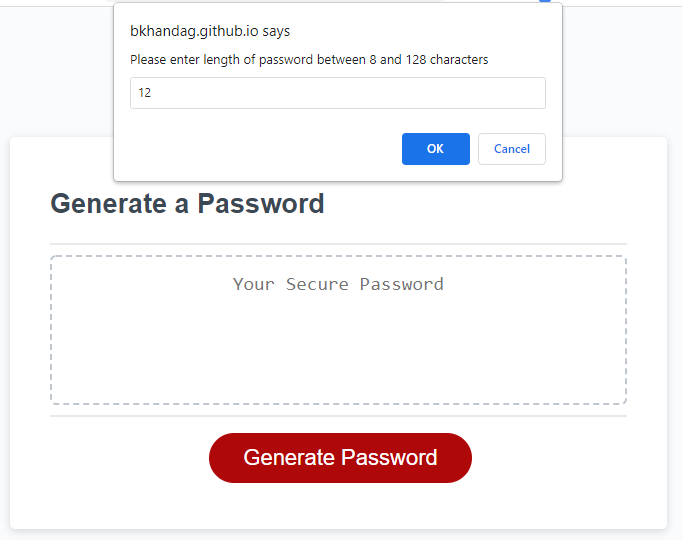
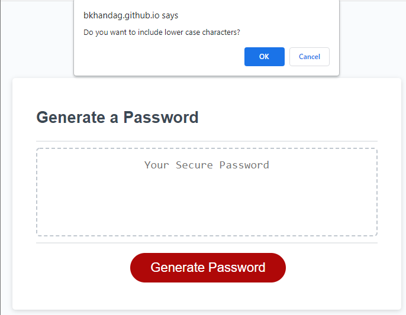
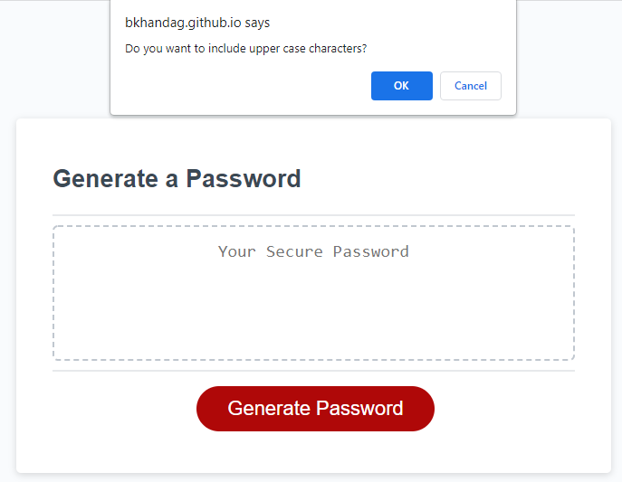
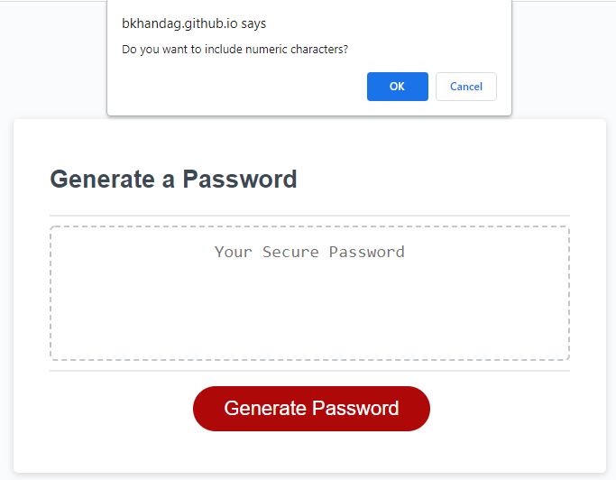

# Random-Password-Generator

## Description:
This is a random password generator. It takes input from user regarding the length and type of characters desired in the password. A message is displayed if an invalid password length or no characters are selected.

### Pseudo Code:
* Create buckets of each lowercase, uppercase, numeric, special characters
* Send prompts and taken response
* Issue an error when length chosen is invalid
* Based on response create a bucket of prompts selected in a randomized way
* Create an password array of lengths specified.
* Add elements to password array to ensure requested characters

## Deployed Application:
https://bkhandag.github.io/Random-Password-Generator/

## Visual:

